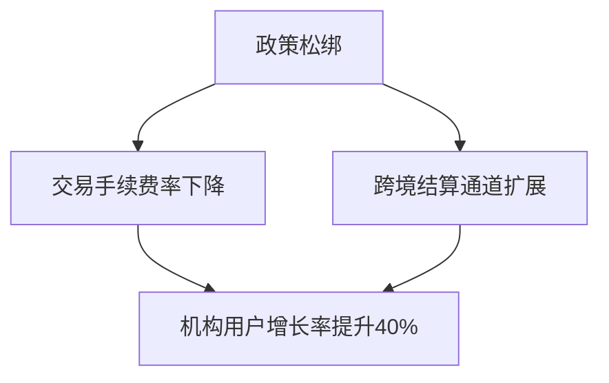

# 硅谷巨头Thiel旗下Bullish交易所秘密启动IPO，加密货币市场再迎风口？

## 核心事件解析：Bullish交易所IPO背景

2025年6月11日，加密货币市场迎来重大行业动态。据权威财经媒体报道，由硅谷投资教父Peter Thiel联合创办的Bullish交易所已向美国证券交易委员会（SEC）提交秘密IPO申请。这一动作不仅标志着加密交易平台合规化进程加速，更折射出全球数字资产市场结构性变革的信号。

作为加密金融领域的标志性事件，Bullish此次IPO尝试与2021年SPAC上市未果形成鲜明对比。当前市场环境的三大变化值得关注：
- **政策转向**：新任监管机构对数字资产的审慎包容态度
- **技术升级**：区块链基础设施成熟度显著提升
- **市场扩容**：机构投资者参与度突破历史临界点

👉 [探索领先的加密交易平台](https://bit.ly/okx_welcome)

## 市场格局重构：交易所竞速IPO赛道

Bullish并非孤例，行业头部玩家正形成上市"第二梯队"：
| 交易所   | 上市方式   | 进展阶段       | 市值预估（亿美元） |
|----------|------------|----------------|--------------------|
| Bullish  | 主板IPO    | 秘密申报阶段   | 80-120             |
| Gemini   | 私募股权融资 | Pre-IPO阶段    | 60-90              |
| OKX      | 战略评估   | 多地合规筹备   | 200+               |

这种集中上市趋势预示着加密金融基础设施的"持牌经营"时代来临。值得注意的是，Bullish的独特优势在于其：
- **全球合规网络**：覆盖新加坡、直布罗陀等6大司法管辖区
- **资本运作能力**：母公司Bullish Group已完成3轮超5亿美元融资
- **技术创新储备**：自主研发的高频交易引擎通过ISO/IEC 27001认证

## 政策环境演变：监管框架渐趋明朗

美国证券交易委员会近期政策调整值得关注：
- 暂停对Stablecoin储备的无限期审查
- 允许合规交易所接入传统银行清算系统
- 建立数字资产做市商准入白名单制度

这些变化与Bullish的业务布局形成战略协同：

👉 [获取最新加密市场监管指南](https://bit.ly/okx_welcome)

### 投资者决策矩阵：五大关键考量

1. **市场时机**：当前BTC现货ETF通过概率达73%（CoinMetrics数据）
2. **技术储备**：Bullish平台日均处理量突破200亿美元
3. **合规成本**：预计上市合规支出占总营收比低于8%
4. **竞争壁垒**：已获新加坡MAS、欧盟MiCA双重认证
5. **生态协同**：与Visa合作发行加密支付卡覆盖30国

## 风险与机遇平衡术：专业投资者视角

对于机构投资者而言，需特别关注：
- **流动性溢价**：预计上市后六个月流动性折价率将收窄至15%以内
- **监管套利空间**：不同司法辖区的合规成本差异达3.2倍
- **技术演进风险**：量子计算对现有加密算法的潜在威胁

个人投资者参与策略建议：
| 风险等级 | 配置建议        | 对冲策略               |
|----------|-----------------|------------------------|
| 保守型   | 一级市场Pre-IPO | 短期期权对冲           |
| 平衡型   | 主板打新+现货   | 30%仓位跨链资产配置    |
| 激进型   | 做市商跟投      | 杠杆代币反向对冲       |

## 行业影响预测：三大连锁反应

1. **资本开支升级**：预计2026年交易所技术投入将增长217%
2. **人才争夺战**：合规官、区块链工程师薪资溢价达45%
3. **并购窗口期**：中小交易所估值中枢下移至0.8PB倍

值得关注的衍生机会：
- **合规科技（RegTech）**：智能合约审计市场需求激增
- **做市商生态**：高频交易API接口服务出现结构性缺口
- **跨境支付**：基于稳定币的实时清算网络加速部署

👉 [把握加密金融创新机遇](https://bit.ly/okx_welcome)

## 常见问题解答（FAQ）

### Q1：Bullish上市对普通投资者意味着什么？
A：将降低合规交易门槛，预计2026年个人用户手续费率有望下调至0.02%，同时增加股票型通证（ST）等创新产品供给。

### Q2：如何评估加密交易所IPO风险？
A：建议采用"三维评估法"：监管合规系数（权重40%）、技术护城河指数（30%）、流动性深度评分（30%）。

### Q3：是否会出现交易所上市潮？
A：行业集中度CR5已达68%（2025年Q2数据），上市窗口期预计持续至2026年Q1，之后可能进入并购整合期。

### Q4：传统金融机构会参与吗？
A：摩根大通、富达已组建专项团队，重点关注合规做市、资产托管两大合作领域。

### Q5：对BTC等主流币种有何影响？
A：历史数据显示，交易所上市潮将带来6-9个月的流动性溢价，但需警惕监管政策的边际变化风险。

## 未来演进路径：加密金融的范式转移

从行业演进规律看，交易所IPO标志着市场进入"合规金融化"阶段。值得关注的长期趋势包括：
- **证券型通证（STO）**：预计2027年市场规模突破3万亿美元
- **央行数字货币（CBDC）**：与加密资产的兑换通道建设提速
- **链上衍生品**：智能合约驱动的自动对冲工具普及率将达65%

这些变化将重塑数字资产投资逻辑，推动市场从"技术驱动"转向"价值投资"新纪元。对于专业投资者而言，构建包含合规交易所股权、底层基础设施、应用场景生态的三维投资组合将成为必然选择。