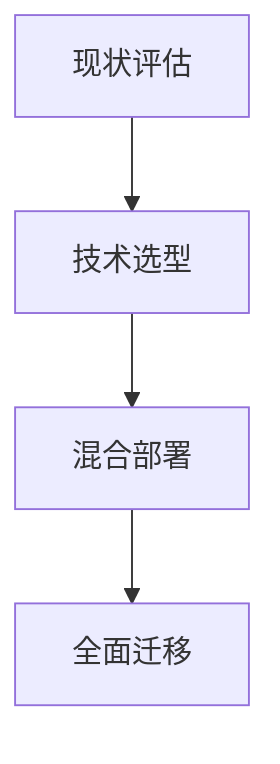

# 量子计算威胁下，企业如何抢先布局抗量子密码学？

## 量子计算对数据安全的颠覆性威胁

随着量子计算技术的突破性进展，全球金融系统面临前所未有的安全挑战。当前依赖的RSA、ECC等主流加密算法，在量子计算机面前可能变得形同虚设。根据美国国家标准与技术研究院（NIST）预测，到2030年量子计算机将具备破解现有加密体系的能力。这意味着金融机构、政府机关等关键领域必须提前布局抗量子密码学转型，否则将面临**敏感数据泄露、数字签名伪造、通信系统瘫痪**等重大风险。

👉 [了解全球首个量子安全金融解决方案](https://bit.ly/okx_welcome)

### 量子计算的核心威胁来源

#### Shor算法：现代加密体系的"拆弹专家"
量子计算机运行Shor算法时，可将2048位RSA密钥的破解时间从数百万年缩短至数小时。这直接威胁到：

- **金融交易安全**：ATM取款、移动支付等场景中的数据传输
- **数字身份认证**：网上银行、电子合同签署的可信度保障
- **基础设施防护**：证券交易所、跨境支付系统的访问控制机制

#### Grover算法：加密强度的"对半砍"
通过量子并行性原理，Grover算法可将SHA-256哈希算法的暴力破解复杂度从2^256降至2^128。虽然未完全破坏对称加密体系，但已迫使行业提前升级密钥长度标准。

| 算法类型 | 传统计算机耗时 | 量子计算机耗时 | 影响范围 |
|---------|----------------|----------------|----------|
| Shor    | 300万年         | 10小时          | 非对称加密 |
| Grover  | 10^12年         | 10^6年          | 对称加密 |

### 量子计算机 vs 经典计算机：技术原理差异

#### 核心组件对比
- **比特**（经典计算机）：二进制开关状态，非0即1
- **量子比特**：利用量子叠加原理，同时处于0和1的叠加态

这种本质差异造就了量子计算机在特定领域的指数级算力提升。例如分解2048位大整数时，经典计算机需要万亿年，而百万量子比特的量子计算机仅需数小时。

#### 当前技术瓶颈
1. **量子纠错难题**：维持量子态稳定性需要极低温环境（接近绝对零度）
2. **硬件扩展限制**：现有量子芯片仅能集成数百个量子比特
3. **算法适配障碍**：仅有约20%的传统算法可有效转换为量子算法

### 金融行业的应对策略矩阵

#### 风险评估三步法
1. **资产清点**：梳理核心加密资产（如客户数据库、交易日志等）
2. **生命周期分析**：评估加密系统平均使用年限（金融行业约为7-10年）
3. **威胁建模**：结合量子计算发展路线图进行风险等级评估

#### 抗量子转型四阶段

**混合部署期建议方案**：
- 采用"经典+量子安全"双层加密架构
- 在TLS 1.3协议中嵌入抗量子密钥交换机制
- 对数字证书实施动态轮换策略

### FAQ：企业最关心的量子安全问题

**Q：如何检测自身系统是否面临量子计算威胁？**
A：可通过NIST的Post-Quantum Cryptography评估工具包进行漏洞扫描，重点关注非对称加密算法使用场景。

**Q：抗量子密码学升级需要多少预算投入？**
A：根据IBM研究，金融企业平均需要投入年度IT预算的3-5%，具体取决于现有系统复杂度。

**Q：现有加密数据是否需要重新加密？**
A：建议对有效期超过5年的数据立即进行量子安全加密重置，防止"现在窃取，未来解密"的攻击策略。

👉 [获取企业级抗量子转型成本测算工具](https://bit.ly/okx_welcome)

### 政策驱动与行业实践

#### 全球监管框架演进
- **美国**：2022年《量子计算网络安全准备法案》要求联邦机构2035年前完成转型
- **欧盟**：将抗量子密码学纳入《数字罗盘2030》战略规划
- **中国**：十四五规划明确量子科技产业化发展目标

#### 银行业先行案例
- 摩根大通：部署基于格密码的量子安全支付系统
- 花旗银行：在跨境结算中试点抗量子TLS协议
- 中国工商银行：参与央行主导的量子密钥分发网络建设

### 未来演进路径

1. **混合加密时代**（2023-2028）：经典算法与抗量子算法并行
2. **渐进替代阶段**（2028-2035）：关键系统优先替换
3. **全面量子安全**（2035+）：构建量子原生安全体系

**抗量子算法选型趋势**：
- 基于格密码（Lattice-based）：NIST标准化首选方案
- 多变量二次方程（MQ）：适用于低功耗物联网设备
- 哈希签名（SPHINCS+）：数字签名领域的量子安全方案

👉 [查看NIST最新抗量子算法标准白皮书](https://bit.ly/okx_welcome)

## 行动倡议：构建量子安全新生态

金融行业应立即启动三方面工作：
1. **成立专项工作组**：整合网络安全、合规、技术团队
2. **制定迁移路线图**：参照ISO/IEC 23894标准进行风险管理
3. **参与标准制定**：积极加入ETSI、IEEE等组织的量子安全标准工作组

量子计算既是挑战更是机遇，率先完成密码学转型的企业将获得显著的竞争优势。正如NIST抗量子密码项目负责人Dustin Moody所言："这不是技术升级，而是安全范式的根本性变革。"现在正是构建量子安全防线的最佳时机。